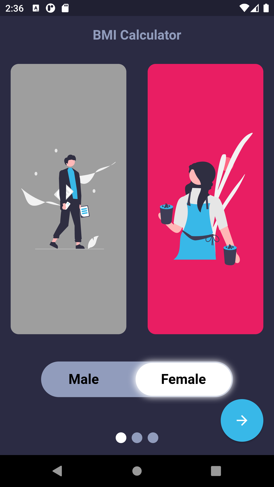
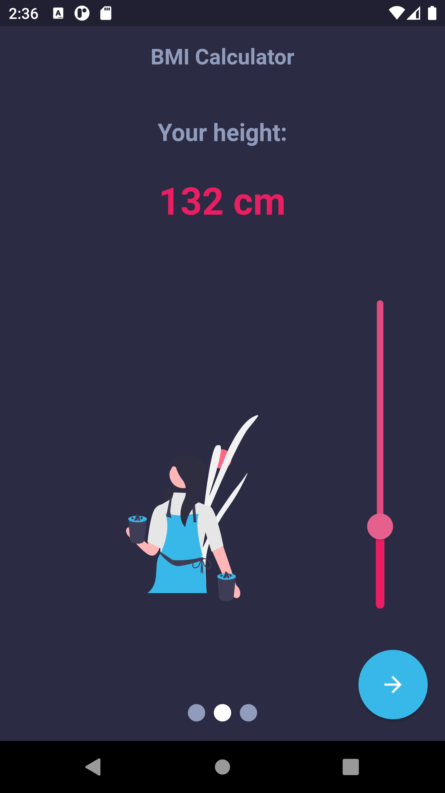

# BMI Calculator Flutter

This is <b>my first Flutter project</b>. I chose the <b>BMI calculator</b> as my first project.  
The application reacts to the selected gender and adapts its color to it. 
An image of a man or woman grows and shrinks depending on the chosen height. 
In addition, the weight is selected on a swipeable weighing scale.   
The project uses the <b>MVP architecture</b>.   
Additional packages used in the project were: smooth_page_indicator and flutter_svg. <bt>
The navigation between the fragments was done using PageView.    Vector images are from the website: [undraw.co](https://undraw.co/).

## Table of contents:
* [Technologies](#technologies)
* [Illustrations](#illustrations)

## Technologies
Project is created with:
* Dart
* Flutter
* Android Studio
* MVP architecture

## Illustrations

 
 
 
 
 
 
 
 
 
 
 
 

